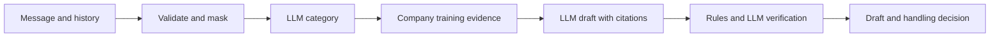

# Configurable Customer Support AI Agent

A customer-support assistant using **Groq GPT-OSS 120B**, pretrained sentence
embeddings, and a local **FAISS vector index**. It provides a customer chat and
an independent staff dashboard for inspecting replies, evidence, and evaluation.
It does not access accounts, create tickets, or transfer customers to a human.

**Start here:** follow steps 1–7 below to go from a fresh GitHub clone to the
running apps. Commands use a Linux Bash terminal. Python 3.12 and `uv` are used
for installation; Git and `curl` are also required. Run each step only after the
previous one succeeds.

```text
Clone → install libraries → download raw data → configure Groq
      → prepare data + generate embeddings + build FAISS → verify → Flask
```

## 1. Clone the repository

```bash
git clone https://github.com/Raj-UtsaV/comcast-support-agent.git
cd comcast-support-agent
```

The repository is private, so your GitHub account needs access. The clone contains
source, configuration templates, tests, and documentation. It does **not** contain
`.env`, installed libraries, the raw dataset, model weights, or generated vectors.

## 2. Install Python and project libraries

With `uv` installed, run:

```bash
uv venv --python 3.12 .venv
uv pip install --python .venv/bin/python --torch-backend cpu -r requirements.txt
uv pip check --python .venv/bin/python
```

The CPU option installs compatible CPU builds of PyTorch and torchvision.
All following commands explicitly use `.venv`, so activating it is optional.

## 3. Download the source dataset

Use the complete **Customer Support on Twitter** CSV, version 10, from
[Thought Vector on Kaggle](https://www.kaggle.com/datasets/thoughtvector/customer-support-on-twitter).
Place it at **`data/raw/twcs.csv`**. Do not substitute Kaggle's small `sample.csv`.
See [dataset provenance and terms](docs/dataset.md).

For a fresh clone, this downloads the pinned source ZIP and extracts the CSV:

```bash
mkdir -p data/raw .cache/dataset
curl --location --fail --show-error --retry 3 \
  --output .cache/dataset/twcs.zip \
  'https://www.kaggle.com/api/v1/datasets/download/thoughtvector/customer-support-on-twitter/twcs%2Ftwcs.csv?datasetVersionNumber=10'
.venv/bin/python -m zipfile -t .cache/dataset/twcs.zip
.venv/bin/python -m zipfile -e .cache/dataset/twcs.zip data/raw
sha256sum data/raw/twcs.csv
```

The expected CSV checksum is:

```text
cd297fcfa1bf6f99938be242e8e578980bc6d1b96adc8691abec9a39175b03c0
```

The CSV is approximately 493 MiB. If the download requires authentication or
returns an error, download version 10 through Kaggle and put the complete CSV at
the same path. Skip this step if you already have the verified file.

## 4. Configure Groq

Create your local settings file without overwriting an existing one:

```bash
test -f .env || cp .env.example .env
```

Open `.env` in your editor and fill in your Groq API key:

```dotenv
LLM_PROVIDER=groq
LLM_MODEL=groq/openai/gpt-oss-120b
LLM_API_KEY=YOUR_GROQ_API_KEY
```

The model/provider values are already in the template. `JUDGE_API_KEY` is needed
only for judged evaluation, not customer chat or vector building. Never commit
`.env`. Review company categories and rules in `configs/comcast.yaml`; the file
already contains starter internet, TV, billing, appointment, and account categories.
Human approval and training-reviewed keyword rules are needed before evaluation.

## 5. Generate processed data and the vector database — one command

```bash
.venv/bin/python -m support_agent setup --config configs/comcast.yaml
```

This command performs the pipeline in order:

1. Reads `data/raw/twcs.csv`, reconstructs company conversations, and writes
   chronological train/validation/evaluation splits under `data/processed/comcast/`.
2. Loads the pinned embedding model, downloading missing weights into
   `.cache/huggingface/` on first use.
3. Selects eligible training question–reply pairs and generates their vectors.
4. Saves and validates the FAISS index files under `artifacts/comcast/search/`.

The saved files include `vectors.npy`, `evidence.jsonl`, a generation manifest,
and `current.json`. **No separate vector database server is required.**
The recorded build contains **22,978 historical pairs with 384-dimensional
vectors**. These are pipeline counts, not answer-quality scores.

Preparation and embedding run locally and do not require Groq credentials.
The first run can take time depending on downloads and CPU speed; a cold setup
is not guaranteed to finish within 15 minutes. Later runs reuse existing
processed data and a valid index. The command finishes with JSON containing
`"status": "ready"` and `"indexed_pairs"`.

## 6. Verify retrieval and live-agent setup

```bash
.venv/bin/python -m support_agent.retrieval inspect --config configs/comcast.yaml
.venv/bin/python -m support_agent.retrieval search --config configs/comcast.yaml \
  --message "My internet connection stopped working."
.venv/bin/python -m support_agent check --config configs/comcast.yaml
```

`inspect` validates the saved index. `search` tests local embedding/retrieval
without calling Groq; an empty match list is possible at the configured threshold.
For customer chat, `check` should show `categories`, `generator`, and `saved_index`
as `ready`. A missing judge key affects evaluation only. `check` validates local
configuration; it does not prove that Groq is reachable or that a key is accepted.

Optionally test a real model request before opening the website:

```bash
.venv/bin/python -m support_agent analyse --config configs/comcast.yaml \
  --message "My internet connection stopped working. What can I try?"
```

## 7. Start the Flask apps

Customer chat:

```bash
.venv/bin/python customer_app.py
```

Open **http://localhost:8000**. Follow-up messages remain in the current page;
refreshing the page or choosing New conversation starts again.

Staff dashboard, in a separate terminal:

```bash
.venv/bin/python app.py
```

Open **http://localhost:8001** and select **comcast** to inspect drafts, evidence,
and evaluation results. Stop with Ctrl+C; restart after changing credentials.
These commands use the development server. For hosting, use the production
commands and container in [deployment instructions](docs/deployment.md).

## Subsequent runs, rebuilds, and common errors

Normally, run only the Flask commands in step 7. Recreating vectors on every
app startup is unnecessary.

| Situation | Action |
| --- | --- |
| Processed data and/or index were deleted | Run the setup command in step 5 |
| Index is stale or you want to regenerate vectors | Run the command below with `--rebuild` |
| Raw data or preparation rules changed | Choose a new `paths.processed_dir` in company YAML, then run setup with `--rebuild` |
| Existing index but model cache was deleted | Use the model-download snippet below; ordinary setup can reuse an index without loading its encoder |
| `ModuleNotFoundError` | Repeat step 2 and launch with `.venv/bin/python customer_app.py` |
| Port is already in use | Stop the old app or choose another `PORT` environment variable |
| Groq request fails | Check the local key, provider availability, and rate limits; rebuilding vectors does not fix API errors |

```bash
.venv/bin/python -m support_agent setup --config configs/comcast.yaml --rebuild
```

Download missing model weights separately when reusing a saved index:

```bash
.venv/bin/python - <<'PY'
from support_agent.shared.config import load_config
from support_agent.embeddings.encoder import create_embedder
create_embedder(load_config("configs/comcast.yaml"), local_files_only=False)
PY
```

For the individual preparation/build commands, see [the rebuild guide](docs/rebuild.md).

## What results can be reproduced?

The steps above reproduce data preparation, vector building, retrieval, and the
apps. The original processing run selected **72,288 messages across 24,065
conversations**, with **22,978 indexed pairs**. Quality metrics against human
labels and judge–human agreement remain pending; the 200-example golden review
sheet is not yet hand-labelled.

Run the automated offline checks after dependency installation:

```bash
PYTHONDONTWRITEBYTECODE=1 .venv/bin/python -B -m pytest -q -p no:cacheprovider
```

The offline tests verify engineering behavior, not customer-quality benchmarks.

New to the codebase? Follow the [guided reading path](docs/reading-guide.md) for
file order, workflow diagrams, and how the modules connect.

## Architecture



| Folder inside `support_agent/` | Responsibility |
| --- | --- |
| `shared/` | Configuration, text cleaning and request/result schemas |
| `data/` | Preparation, conversations, splits, evidence and annotation exports |
| `embeddings/` | Pretrained text encoder and its provider interface |
| `retrieval/` | Search, saved indexes, fingerprints and retrieval commands |
| `models/` | Configurable LLM client |
| `agent/` | Support workflow, safety, categories, runtime |
| `evaluation/` | Evaluation runner, baselines, metrics and human ratings |
| `ui/` | Customer chat, troubleshooting guides, staff styling, and evaluation views |

The package root contains `__init__.py`, the main CLI `__main__.py`, and `setup.py`.
Walkthroughs mirror these folders under `docs/`; test explanations live in
`docs/tests/`. See the [complete folder structure](docs/structure.md), including
module locations and command entry points.

## Human labels and evaluation

Two real-data review sheets are already provided:

- `data/golden_set_template.csv`: 200 distinct held-out conversations.
- `data/training_labels_template.csv`: 500 distinct training conversations.

For fresh alternative sheets, choose unused output paths:

```bash
.venv/bin/python -m support_agent.data.annotations golden --config configs/comcast.yaml \
  --output data/golden_review_new.csv
.venv/bin/python -m support_agent.data.annotations training --config configs/comcast.yaml \
  --output data/training_review_new.csv
```

Human reviewers fill approved intent IDs, `should_escalate` (`true`/`false`)
and `relevant_evidence_ids` (a JSON list of eligible training evidence IDs).
`[]` means no relevant evidence was found; blank means unfinished. Candidate
evidence IDs/text are available through retrieval and the saved `evidence.jsonl`.
Keep original company/conversation/message IDs unchanged.

Save completed golden rows as `data/golden_set.csv`. For the majority baseline,
save completed training rows as `data/training_labels.csv`; remove unlabelled
rows from that completed subset. Golden evaluation needs 150–250 distinct
conversations. Training labels need approved intents; their escalation/relevance
columns are not used. Do not silently exclude difficult golden examples.

Rebuild the index after activating golden annotations, then freeze prompts,
categories, rules and thresholds. Full evaluation:

```bash
.venv/bin/python -m support_agent.retrieval build --config configs/comcast.yaml --rebuild
.venv/bin/python -m support_agent.evaluation run --config configs/comcast.yaml \
  --training-labels data/training_labels.csv
```

The run saves `report.json`, `predictions.json` and `human_scores_template.csv`
under a new `results/comcast/evaluation-.../` directory. Complete independent
human scores for the exact saved drafts, then import without regenerating them:

```bash
.venv/bin/python -m support_agent.evaluation rate --config configs/comcast.yaml \
  --run results/comcast/evaluation-YOUR_RUN \
  --human-scores data/human_scores.csv
```

Replace `YOUR_RUN` with the directory printed by evaluation. The template carries
reply checksums, preventing ratings for a different draft from being reused.
Partial ratings remain visibly incomplete. `run --metrics-only` skips judging
explicitly and does not satisfy the full assignment evaluation.

Metrics cover intent accuracy/macro-F1/per-category results, Recall@k, escalation,
auto-handle/false-auto-handle rates, human-verified safe coverage, reply-quality
dimensions and judge/human agreement. See [metric definitions](docs/evaluation/metrics.md)
for denominators and unavailable values. Baselines use training majority/generic
reply and keyword classification/TF-IDF retrieval; both always escalate.

## Reproduction and extension

The offline test suite, cached-index inspection/search and loading
saved evaluation reports form the fast reproduction path. These do not require
re-encoding the corpus or rerunning paid judging. Full live evaluation of 200
messages makes many provider calls and can exceed 15 minutes; its runtime and
cost depend on your provider. No live quality results are currently claimed.

Another company supplies its own YAML, source account IDs, category taxonomy,
rules and instructions. Another CSV layout can reuse configurable column maps;
another dataset format implements the `data.conversations.ADAPTERS` reader contract
and preserves common message fields and split invariants.

An embedding provider implements `TextEmbedder` and is selected by its factory.
A text provider implements `TextGenerator`; the existing factory uses LiteLLM
provider routing. A replacement search provider preserves company/model checks,
ranked evidence, thresholds and conversation deduplication behind the search
factory; adapt persistence as required by that backend. Never weaken company
or golden-set exclusions for a provider change.

## Limitations

The software is implemented. Real category approval, human
labels/ratings and configured live models are still required to claim measured
agent quality. Historical replies may be wrong, outdated or unresolved; model
verification and regex safety checks can miss errors. The UI has no production
authentication or account integrations. Exact in-memory search and repeated
freshness hashes suit this dataset, not unlimited-scale serving. Model weights
truncate long text according to their tokenizer limit.

See the per-file walkthroughs in `docs/`.
