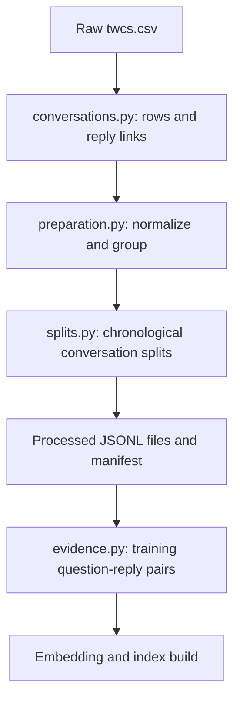
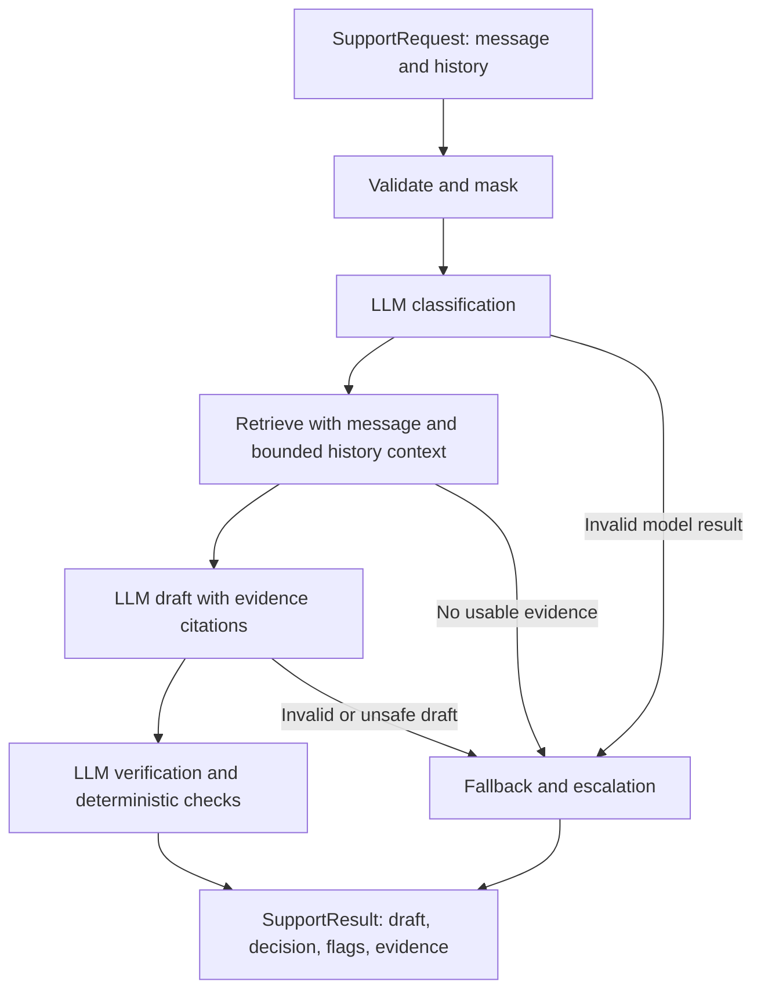
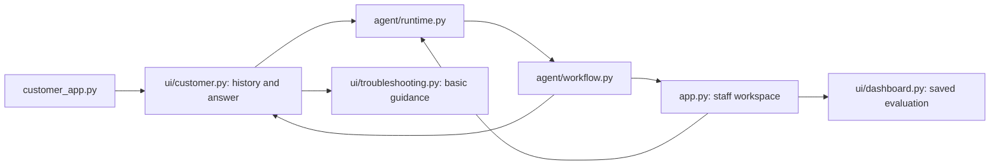
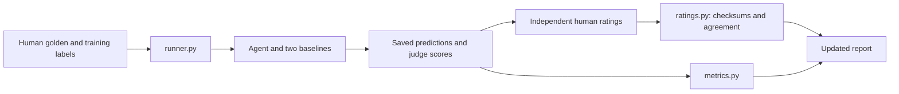

# Guided reading path: which file to read next, and why

Read this project by workflow rather than alphabetically. There are three main
journeys: preparing the evidence, answering a customer, and evaluating the
answers. Configuration and typed data structures connect them.

The links below open actual source files. Use the other documents in `docs/`
when you want a deeper explanation of one module.

## 1. Understand the purpose

Read [README.md](../README.md), then [report.md](../report.md).

The README explains how to run the project. The report explains what good
support means, what was deliberately left out, and what has actually been
measured. Keep these distinctions in mind:

- Embeddings find related historical conversations; the LLM writes replies.
- Historical replies are evidence, not proof of successful resolution.
- Live model replies, scripted demo replies, and configured troubleshooting guides are different paths.
- Tests and corpus counts do not substitute for human-labelled quality results.

**Next:** find where those model and behavior choices are configured.

## 2. Read configuration before implementation

| Order | File | What to understand | Connection |
| --- | --- | --- | --- |
| 1 | [configs/base.yaml](../configs/base.yaml) | Shared paths, model settings, prompts, thresholds, history limits, judge rubric | Defaults used by all workflows |
| 2 | [configs/comcast.yaml](../configs/comcast.yaml) | Company instructions, categories, risk categories, customer guidance | Company overrides |
| 3 | [.env.example](../.env.example) | Model/provider names and required credential variables | Your private `.env` supplies local values |
| 4 | [shared/config.py](../support_agent/shared/config.py) | `load_config`, `_merge`, `_expand_environment` | Combines defaults, overrides, and environment into one validated dictionary |
| 5 | [configs/demo.yaml](../configs/demo.yaml) | Explicit demo settings | Selects the scripted path without credentials |

Follow `load_config()` from top to bottom. Existing process environment values
win over `.env`, and paths become absolute relative to the project root. That is
why different entry points can use the same settings consistently.

**Checkpoint:** explain where the Groq model name and escalation threshold come from.

## 3. Learn the data passed between functions

Read [shared/schemas.py](../support_agent/shared/schemas.py), then
[shared/text.py](../support_agent/shared/text.py).

| Object | Meaning | Producer → consumer |
| --- | --- | --- |
| `SupportRequest` | Current message, company, prior conversation | UI/CLI → workflow |
| `HistoryMessage` | One customer or assistant turn | Chat → workflow → model context |
| `Classification` | Intent, confidence, explanation | Model → workflow/safety |
| `ReplyDraft` | Proposed reply with evidence IDs | Model → verification |
| `ReplyCheck` | Groundedness and safety verdicts | Verifier → workflow |
| `SupportResult` | Draft, decision, flags, retrieved evidence | Workflow → UI/evaluation |
| `JudgeScores` | Quality scores and explanations | Judge → metrics |

Look at `normalize_text()` in `text.py`: messages are normalized and masked before
model/retrieval use. Masking is imperfect; the report documents an address miss.

## 4. Follow setup and data preparation

Start with [support_agent/__main__.py](../support_agent/__main__.py). Find the
`setup` branch, then open [setup.py](../support_agent/setup.py).
`setup_pipeline()` orchestrates this command:

```bash
.venv/bin/python -m support_agent setup --config configs/comcast.yaml
```

Read its dependencies in this order:

| Order | File / function | Why it comes next |
| --- | --- | --- |
| 1 | [data/preparation.py](../support_agent/data/preparation.py): `prepare_data` | Shows the whole preparation sequence and outputs |
| 2 | [data/conversations.py](../support_agent/data/conversations.py): `index_twitter_csv`, `company_groups` | Converts CSV rows and reply links into conversations, using temporary SQLite storage |
| 3 | [data/splits.py](../support_agent/data/splits.py): `split_conversations`, `golden_conversations` | Explains chronological splits, quarantine, and golden exclusions |
| 4 | Return to `prepare_data` | Understand the writing of JSONL splits, review sheet, and manifest |
| 5 | [data/evidence.py](../support_agent/data/evidence.py): `collect_evidence` | Selects eligible linked training question–reply pairs |



Root [data/](../data/) contains data files; [support_agent/data/](../support_agent/data/)
contains Python code. Preparation does not train a classifier or label examples.
It refuses to overwrite an existing processed directory.

## 5. Understand the vector database

| Order | Read | Main idea |
| --- | --- | --- |
| 1 | [embeddings/encoder.py](../support_agent/embeddings/encoder.py) | `create_embedder()` loads the pinned model; `encode()` converts text to vectors |
| 2 | [retrieval/search_index.py](../support_agent/retrieval/search_index.py) | `FaissSearchIndex` searches vectors, filters results, and deduplicates conversations |
| 3 | [retrieval/index_store.py](../support_agent/retrieval/index_store.py) | `build_saved_index()` saves a generation; `load_saved_index()` reloads it |
| 4 | [retrieval/index_state.py](../support_agent/retrieval/index_state.py) | Fingerprints and model identity detect stale/incompatible artifacts |
| 5 | [retrieval/service.py](../support_agent/retrieval/service.py) | Exposes build, inspect, and search commands |

On disk the index consists of `vectors.npy`, `evidence.jsonl`, a generation
manifest, and `current.json` pointing to that generation. FAISS is reconstructed
in memory; there is no separate database server.

The builder encodes historical questions once. Runtime encodes the incoming query
and searches stored vectors. App startup does not regenerate missing processed
data or indexes. See [rebuild.md](rebuild.md) for commands.

## 6. Follow one request through the backend

Read [agent/runtime.py](../support_agent/agent/runtime.py) first. `create_agent()`
selects demo or real components. `SavedRetriever` joins the saved index and query
encoder, checking freshness around searches.

Then read [agent/workflow.py](../support_agent/agent/workflow.py), especially
`SupportAgent.analyse()`. Open these files as you encounter their calls:

| Workflow step | Supporting file | Responsibility |
| --- | --- | --- |
| Validate categories | [agent/taxonomy.py](../support_agent/agent/taxonomy.py) | Approved IDs, descriptions, rule references |
| Classify, draft, verify | [models/client.py](../support_agent/models/client.py) | Ordered chat history and structured tasks through LiteLLM; JSON validation |
| Detect risks and decide | [agent/safety.py](../support_agent/agent/safety.py) | Pattern flags plus classification/retrieval findings |
| Run explicit demo | [agent/demo.py](../support_agent/agent/demo.py) | Scripted generator and retriever |



Classification, drafting, and verification are separate model calls, each with
conversation context. Separate calls do not mean separate conversations.
Retrieval also carries context so “all devices” retains the original issue.

**Checkpoint:** `reply_status` describes the draft; `decision` describes handling.
Inspect both, plus the flags, when investigating escalation.

## 7. Follow the customer and staff screens

Read [customer_app.py](../customer_app.py), then
[ui/customer.py](../support_agent/ui/customer.py). The first is just an entry point.
In the second, `main()` manages session history, input, rendering, and reset;
`answer()` constructs a request and calls the backend.

Next read [ui/troubleshooting.py](../support_agent/ui/troubleshooting.py). It can
select configured basic guidance and follow-up branches when an ordinary
technical request gets a fallback/handoff. These finite guides are not model
predictions and do not override account/security handling or failed attempts.

Then read [app.py](../app.py), [ui/style.py](../support_agent/ui/style.py), and
[ui/dashboard.py](../support_agent/ui/dashboard.py). These implement the staff
workspace, its appearance, and saved evaluation views. Settings remain in YAML
and `.env`; customer chat exposes no model configuration controls.



History is local to the browser session and bounded before model requests.
“New conversation” clears it. It is not a saved ticket or shared staff transcript.
See [customer-app.md](customer-app.md) for ports and launch commands.

## 8. Read evaluation as a separate workflow

| Order | Read | Connection |
| --- | --- | --- |
| 1 | [data/annotations.py](../support_agent/data/annotations.py) | Exports review sheets; validates human labels against source identities |
| 2 | [SAMPLING_AND_LABELLING.md](../submission/SAMPLING_AND_LABELLING.md) | Sampling, human decisions, missing labels |
| 3 | [evaluation/runner.py](../support_agent/evaluation/runner.py) | Runs agent and two baselines; saves exact predictions |
| 4 | [evaluation/baselines.py](../support_agent/evaluation/baselines.py) | Majority/generic and keyword/TF-IDF comparisons |
| 5 | [evaluation/metrics.py](../support_agent/evaluation/metrics.py) | Metrics and denominators |
| 6 | [JUDGE_RUBRIC.md](../submission/JUDGE_RUBRIC.md) | Quality scores and independent human review |
| 7 | [evaluation/ratings.py](../support_agent/evaluation/ratings.py) | Matches ratings to reply checksums; calculates agreement |



The harness evaluates individual golden messages without prior turns. It does
not measure the complete multi-turn customer experience or UI-only guides.

## 9. Use tests as worked examples

Read [tests/conftest.py](../tests/conftest.py) first: it disables network access
and real credentials. Then pair each component with its tests:

| Topic | Test file |
| --- | --- |
| Preparation and conversation separation | [test_pipeline.py](../tests/test_pipeline.py) |
| Evidence eligibility | [test_evidence.py](../tests/test_evidence.py) |
| Reusing/rebuilding setup outputs | [test_setup.py](../tests/test_setup.py) |
| Persistence and stale indexes | [test_index_store.py](../tests/test_index_store.py) |
| Decisions and conversation-aware retrieval | [test_agent.py](../tests/test_agent.py) |
| Provider ordering and staff UI | [test_models_ui.py](../tests/test_models_ui.py) |
| Customer follow-ups and reset | [test_customer_ui.py](../tests/test_customer_ui.py) |
| Guidance branches | [test_troubleshooting.py](../tests/test_troubleshooting.py) |
| Evaluation and human rating import | [test_evaluation.py](../tests/test_evaluation.py) |

Run them without regenerating local test/bytecode caches:

```bash
PYTHONDONTWRITEBYTECODE=1 .venv/bin/python -B -m pytest -q -p no:cacheprovider
```

## 10. Finish with reproducibility and design decisions

Read [submission/STATUS.md](../submission/STATUS.md), then
[submission/README.md](../submission/README.md),
[reproduce_submission.py](../scripts/reproduce_submission.py), and
[package_submission.py](../scripts/package_submission.py).

Replay verifies engineering counts, not human quality. Packaging includes a
current prepared/index snapshot while excluding credentials and caches. A Git
checkout excludes these generated artifacts via [.gitignore](../.gitignore),
so replay needs the submission bundle or regenerated outputs. Finally, read
[decision_log.md](../decision_log.md) for the design tradeoffs.

## Where to start when changing something

| Change | Start here | Then inspect |
| --- | --- | --- |
| Model or credentials | `.env` / `.env.example` | `models/client.py`; restart both apps |
| Categories or company instructions | `configs/comcast.yaml` | `agent/taxonomy.py`, `agent/workflow.py` |
| Too much escalation | `agent/safety.py`, `configs/base.yaml` | Actual result flags in staff UI |
| Lost follow-up context | `ui/customer.py` | `models/client.py`, `agent/workflow.py`, `ui/troubleshooting.py` |
| Missing/stale vectors | `setup.py` | `retrieval/index_store.py`, `retrieval/index_state.py` |
| Customer appearance | `ui/customer.py` | `customer_app.py` |
| Staff appearance | `ui/style.py` | `app.py`, `ui/dashboard.py` |
| Metrics or judge agreement | `evaluation/metrics.py` | `evaluation/runner.py`, `evaluation/ratings.py` |

For a short first pass, read these seven files in order:
`README.md` → `configs/comcast.yaml` → `shared/schemas.py` → `setup.py` →
`agent/workflow.py` → `ui/customer.py` → `evaluation/runner.py`.
The Python paths in that shortcut are relative to `support_agent/`.
